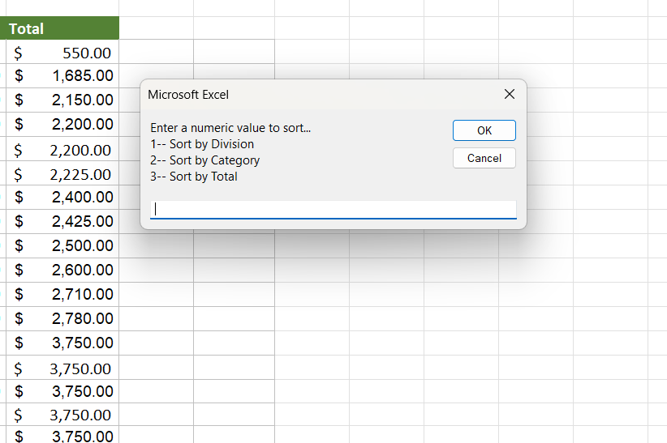
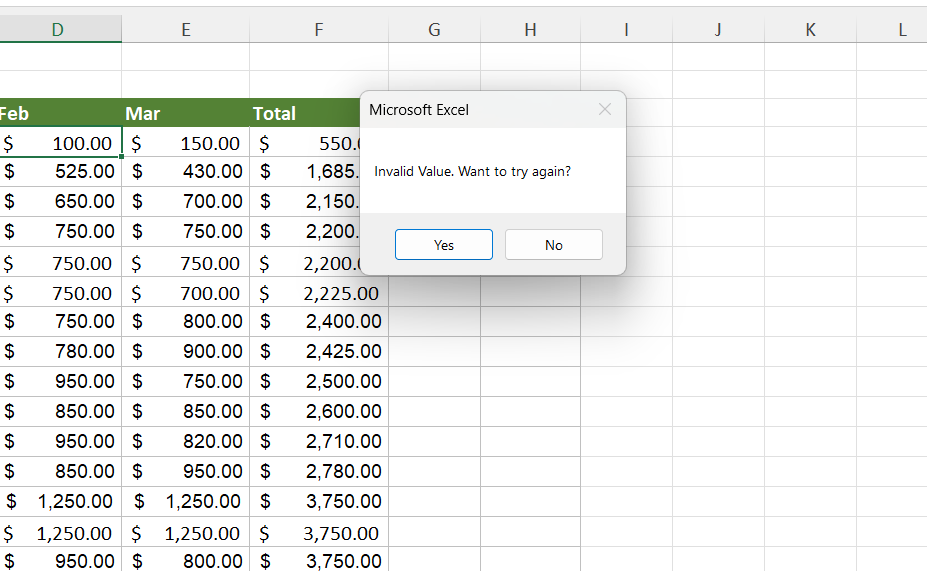

#  Excel VBA Record Sorter


A simple VBA‑powered Excel tool that lets users sort a data table by selected column using an interactive input box.  
Built by combining **Record Macro** for the core sorting logic with **custom VBA** for user interaction and error handling.

---

##  Project Overview

The **SortingRecords.xlsm** workbook contains a sheet named **“SORT RECORDS”** with the columns:

| Division | Category | Jan | Feb | Mar | Total |
|----------|----------|-----|-----|-----|-------|

Instead of manually sorting each column via the Excel ribbon, this macro provides a **dynamic prompt** where the user types a number to sort the table:

- `1` → Sort by **Division**
- `2` → Sort by **Category**
- `3` → Sort by **Total**

The project shows how recorded macros can be  integrated with custom VBA to create a user‑friendly interface — including error handling with a retry option.

---

##  Features

-  **Interactive Input Box** – clear, multi‑line prompt that guides the user.
-  **Modular Sorting** – separate recorded macros (`DivisionSort`, `CategorySort`, `TotalSort`) for each column.
-  **Error Handling** – detects invalid input and offers a “Try Again” dialog (Yes/No).
-  **Clean Code Structure** – easy to extend with new sort options.
-  **Screenshot‑driven Documentation** – visual walkthrough of the workflow.

---

##  Technologies Used

- **Microsoft Excel** (`.xlsm` macro‑enabled workbook)
- **VBA (Visual Basic for Applications)** – recorded and written code

---

##  Installation & Setup

1. **Download** the file `SortingRecords.xlsm` from the repository.
2. Open the workbook in **Microsoft Excel** (desktop version recommended).
3. If prompted, **Enable Macros** (the workbook is digitally signed with your trust by default when saved locally, but you may need to “Enable Content” in the security warning bar).
4. Make sure the sheet **“SORT RECORDS”** contains data with the correct column headers.

---

##  Usage

1. Press `Alt + F8` to open the **Macro** dialog, select `userInputForm`, and click **Run**.
2. A prompt appears:

   

3. Enter **1**, **2**, or **3** to sort the table accordingly.
4. If you enter an invalid value, an error message will ask if you want to try again:

   

   - Click **Yes** to return to the input box, or **No** to cancel.

---

##  Screenshots

| Prompt                                      | Error Handling                      |
| ------------------------------------------- | ----------------------------------- |
|  |  |

*(After sorting, the table is instantly rearranged — you can observe the result directly in Excel.)*

---

##  Project Structure

```
📁 MS-Excel-VBA-Record-Sorter/
├── SortingRecords.xlsm   # Main macro-enabled workbook
├── README.md                 # You are here
└── img/
    ├── user-input-form.png   # Screenshot of the input box
    └── error-msg.png         # Screenshot of the error message
```

---

##  How It Works

The macro `userInputForm` combines custom VBA with pre‑recorded sorting routines.  
Here is the complete code inside the workbook:


```vba
Public Sub userInputForm()


    Dim userInput As String
    Dim promptMSG As String
    Dim tryAgain As Integer

    promptMSG = "Enter a numeric value to sort..." & vbCrLf & _
                "1-- Sort by Division" & vbCrLf & _
                "2-- Sort by Category" & vbCrLf & _
                "3-- Sort by Total"

    userInput = InputBox(promptMSG)

    If userInput = "1" Then
        DivisionSort
    ElseIf userInput = "2" Then
        CategorySort
    ElseIf userInput = "3" Then
        TotalSort
    Else
        tryAgain = MsgBox("Invalid Value. Want to try again?", vbYesNo)
        If tryAgain = 6 Then
            userInputForm

        End If
    End If
End Sub
```


- **DivisionSort**, **CategorySort**, and **TotalSort** are macros originally recorded with Excel’s `Record Macro` feature.
- The custom `userInputForm` routine ties them together with a user‑friendly interface.
- The retry logic shows clean VBA error handling using a `MsgBox` with `vbYesNo`.

---

##  Future Improvements

- [ ] Add sorting for the month columns (`Jan`, `Feb`, `Mar`).
- [ ] Allow ascending/descending order selection.
- [ ] Validate input to ignore empty or cancelled prompts.
- [ ] Create a custom ribbon button or keyboard shortcut for one‑click access.
- [ ] Extend the tool to work with any sheet or dynamic ranges.

---

##  Author

**Abdul Rauff**